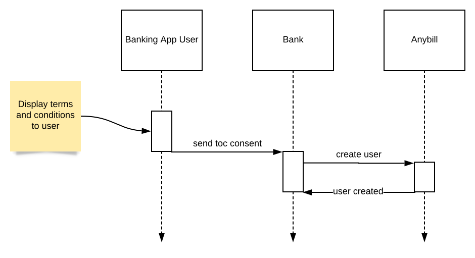
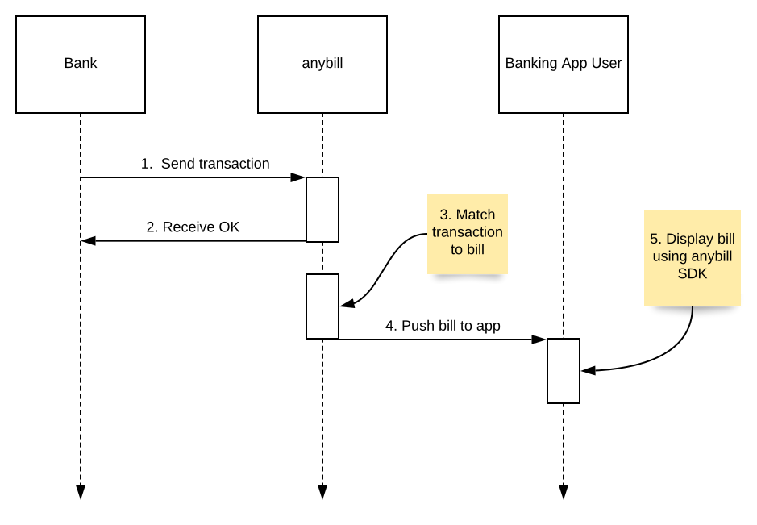

# Bank integration
## Getting started

As a banking partner of anybill you can integrate the anybill SDK into your own banking app and display bills of your users transactions.
This requires a few simple steps in order to get started:

* **Register:** Register as a banking partner to anybill and integrate the anybill SDK into you app.
* **Onboard users:** Display proper terms and conditions to your users. If they consent, register the user in anybill.
* **Send transactions:** Whenever a transaction is created, send it to anybill. We will try to match the transaction data to any of users bills. If there is a match, it will be sent to the users device ready to display.

## User onboarding
Anybill requires a users consent before any transactions are processed. 
# 

## Transaction processing
Processing a transaction is an asyncronous processes. Transactions are delivered to anybill using a REST API endpoint. You will rceive a OK if the transaction is accepted. Anybill will then process the transaction and match it to a users bill. If there was a match it is pushed to your users device and can be displayed.
# 